# Occupancy-gridmap-building-with-laser-2D
In this repository you will find the opcional project of the Robotics subject at the **[University of Málaga](https://www.uma.es/#gsc.tab=0)** fully implemented by the student of Computer Science **[Marcos Hidalgo](https://github.com/MarkosHB)**. Our goal is to implement the needed functionality so a robot moving in an environment can build an occupancy gridmap of it. 

<h4 align="center">Occupancy Gridmap example</h4>

  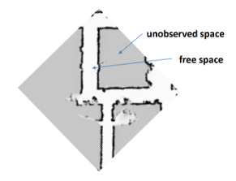

Some considerations of the project:
- A 2D laser simulator is provided.
- The environment is defined with lines.
- Localization is known.
- In order to build the map, the robot has to move within it.

## Algorithm progression through iterations (Demo)
- <h3>Iteration 1</h3>

  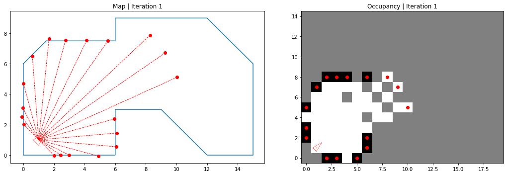

- <h3>Iteration 2</h3>

  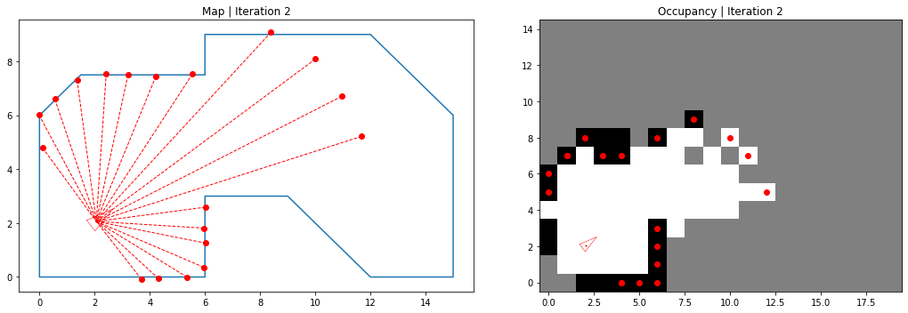

- <h3>Iteration 3</h3>

  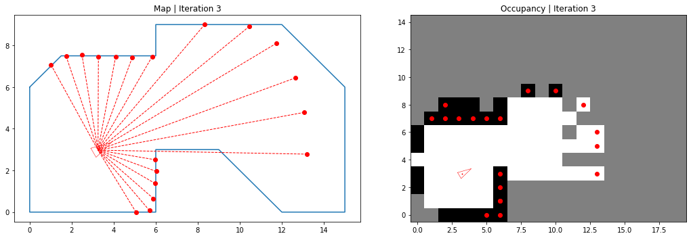

- <h3>Iteration 4</h3>

  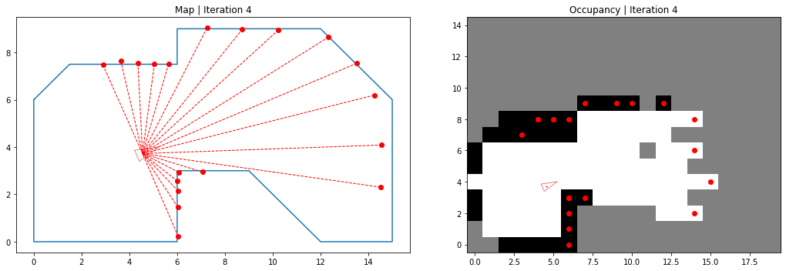

- <h3>Iteration 5</h3>

  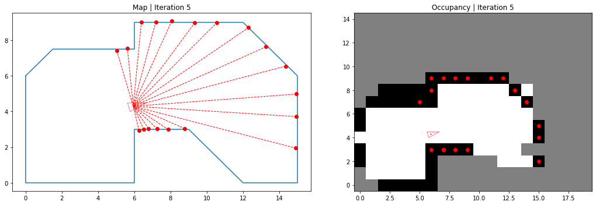

- <h3>Iteration 6</h3>

  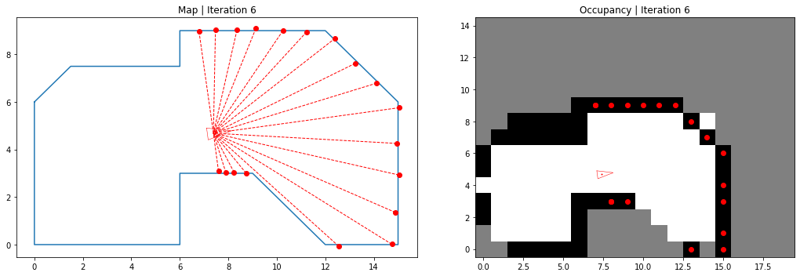

- <h3>Iteration 7</h3>

  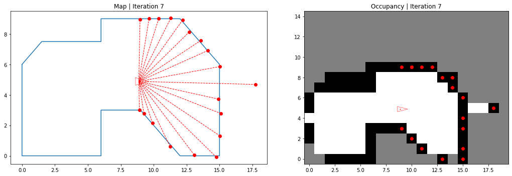

- <h3>Iteration 8</h3>

  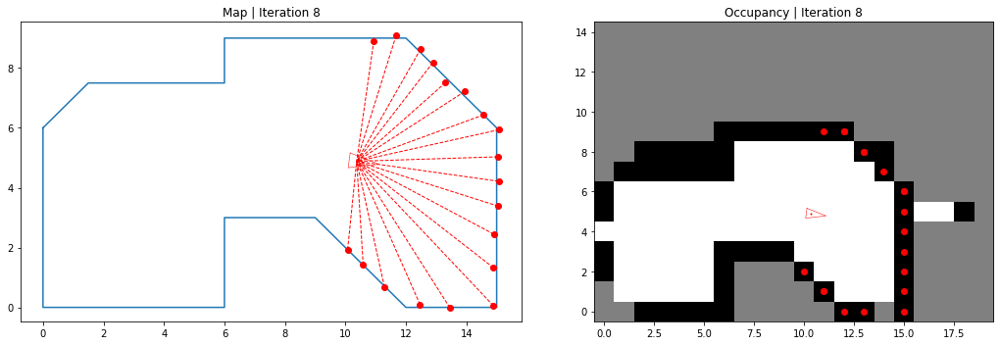

- <h3>Iteration 9</h3>

  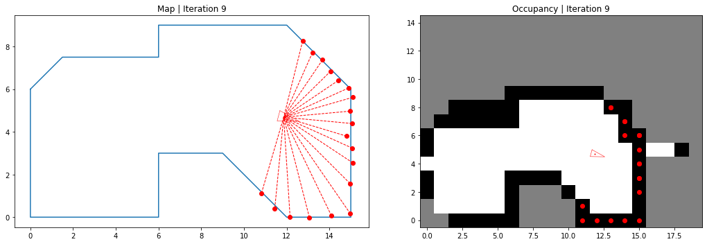

- <h3>Iteration 10</h3>

  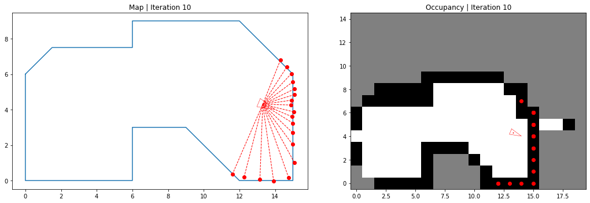

## Interesting conclusions
After the last iteration of our algorithm, some aspects must be highlighted:
- The bottom-left corner never received a laser beam ad so stays been unknown. This is done on purpose to show the importance of the path our robot follows for the map building (and also to demonstrate that the algorithm works well).
- The beam that goes through the wall is still represented, although we do not know why the laser made that observation (maybe it is an error but needs to be considered).
- Some grid cells content may be impredecible until an observation is made (for example, the cell [0,4] is empty but is a wall). This is due to the bresenham algorithm that may mark as empty any unobserved cell.
- Diagonal surfaces are dificult to discretice. Very similar observations may be classified in diferent cells. 

In gerenal terms, the algorithm implemented works fine but in this particular case the path followed by the robot needs to be adjust in a way that more observations are made to the left part of the map. This is made on porpouse and it shows the importance of having multiple observations even if they are of the same surface. 
